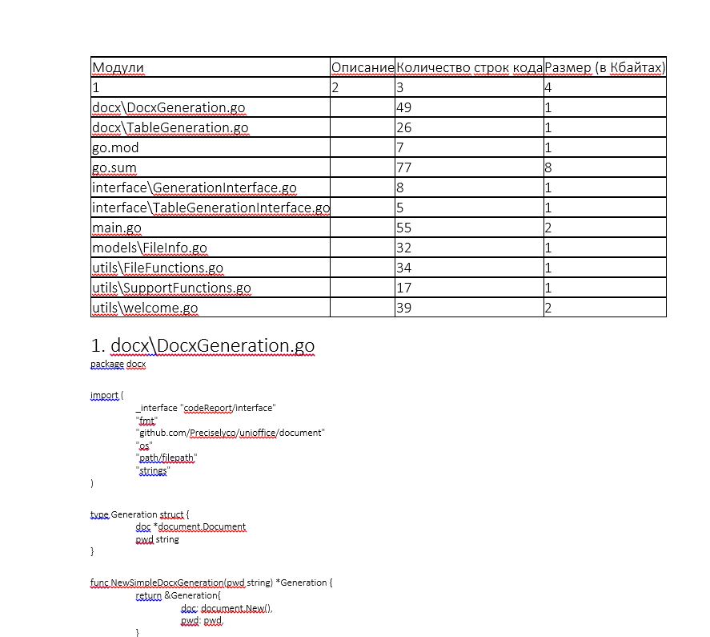

# CodeReport

### CodeReport is a tool for generating reports from code.


### Structure:
```text
│   go.mod
│   go.sum
│   main.go
│   result.png
|
├───docx
│       DocxGeneration.go
│       TableGeneration.go
│
├───interface
│       GenerationInterface.go
│       TableGenerationInterface.go
│
├───models
│       FileInfo.go
│
└───utils
        FileFunctions.go
        SupportFunctions.go
        welcome.go
```